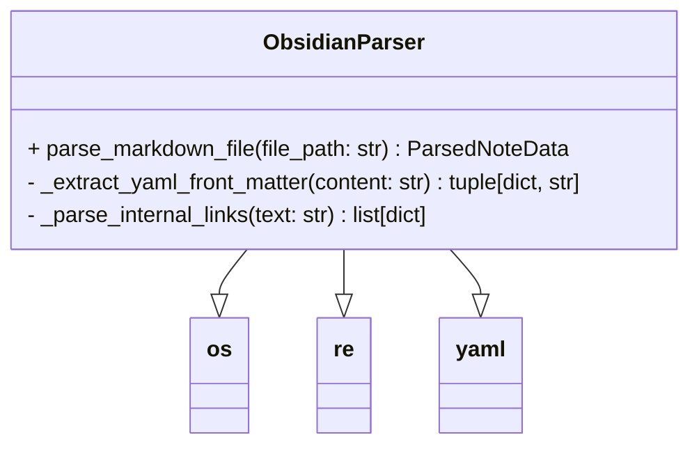
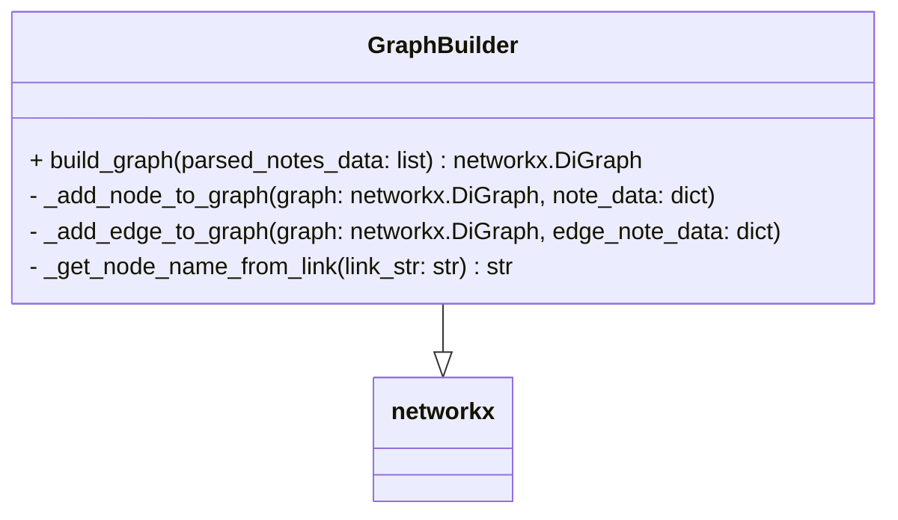
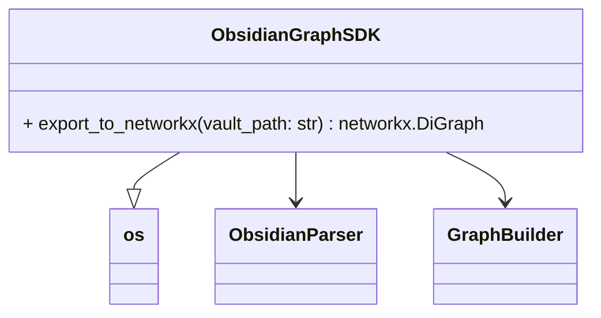

# Obsidian Graph SDK - 详细设计文档

## 1. 架构与模块

### 1.1 模块分解

SDK 包含三个主要模块：

- **`obsidian_parser.py` (File Parser)：** 负责单个 Obsidian Markdown 文件的读取、YAML front matter 解析、正文提取和内部链接识别。
- **`graph_builder.py` (Graph Builder)：** 负责接收解析后的数据，并根据业务逻辑构建 NetworkX 图的节点和边。
- **`sdk_interface.py` (SDK Interface)：** 作为 SDK 的入口点，协调文件遍历、解析和图构建过程，并提供给外部调用的 API。

### 1.2 模块交互图 (Mermaid)

graph TD
    subgraph SDK Public Interface
        A[ObsidianGraphSDK.export_to_networkx]
    end

    subgraph Internal Modules
        B[ObsidianParser]
        C[GraphBuilder]
    end

    subgraph Data Flow
        D[Obsidian Vault (Files)]
        E[Parsed Note Data (Dicts)]
        F[NetworkX DiGraph]
        G[Edge Relation Info (List of Dicts)]
    end

    A -- Calls --> B
    A -- Calls --> C

    D -- Reads --> B : File Reading
    B -- Outputs --> E : Per-file parsed data
    E -- Inputs --> C : All parsed note data

    C -- Processes (Stage 1) --> F : Adds Nodes
    C -- Collects (Stage 1) --> G : Edge note details
    G -- Processes (Stage 2) --> C : Uses to add Edges
    C -- Outputs --> F : Final Graph

    A -- Returns --> F

## 2. 数据结构定义

### 2.1 `ParsedNoteData` (Internal Representation for each Obsidian file)

```python
# Represents the parsed content of a single Obsidian Markdown file.
# This dict is passed from ObsidianParser to GraphBuilder.
{
    "file_path": str,                   # Absolute path to the .md file
    "note_name": str,                   # File name without extension (e.g., "My Concept")
    "yaml_front_matter": dict,          # Raw parsed YAML (e.g., {'type': 'node', 'aliases': ['MC']})
    "content": str,                     # Full markdown content after YAML (body)
    "_internal_links_info": list[dict]  # List of links found in 'content'
                                        # Each link: {"target_note_name": str, "link_text": str}
}
```

### 2.2 NetworkX Node Attributes (for `type: node` and `type: event` notes)
```python
{
    "type": str,                        # "node" or "event" (from YAML)
    "aliases": list[str],               # from YAML
    "describe": str,                    # from YAML
    "version": str,                     # from YAML
    "over": str,                        # from YAML
    "tags": list[str],                  # from YAML
    "content": str,                     # Full markdown body content
    "_all_yaml_props": dict,            # Raw YAML front matter dict
    "_internal_links_info": list[dict]  # List of internal links from note's body
}
```
### 2.3 NetworkX Edge Attributes (for `type: edge` notes)

```python
{
    "relation_type": str,               # Derived from 'describe' of the edge note (e.g., "DISCUSSED")
    "defined_by_note_name": str,        # The note_name of the original 'type: edge' Obsidian note
    "original_content": str,            # Full markdown body content of the 'type: edge' note
    "_all_yaml_props_from_edge_note": dict, # Raw YAML front matter dict of the 'type: edge' note
    "_internal_links_info": list[dict], # List of internal links from the 'type: edge' note's body
    "version": str,                     # From 'version' of the edge note's YAML
    "over": str,                        # From 'over' of the edge note's YAML
    "tags": list[str],                  # From 'tags' of the edge note's YAML
    # ... any other YAML properties from the edge note will also be added here
}
```

## 3. 模块详细设计

### 3.1 `obsidian_parser.py`

- **Class/Functions:**
    
    - `class ObsidianParser:`
        - `parse_markdown_file(file_path: str) -> ParsedNoteData:`
            - **Purpose:** Reads a Markdown file, extracts YAML, content, and internal links.
            - **Steps:**
                1. Read file content.
                2. Call `_extract_yaml_front_matter` to get YAML and body.
                3. Call `_parse_internal_links` on the body to get link info.
                4. Construct and return `ParsedNoteData` dict.
            - **Error Handling:** Catches `IOError` for file access, `yaml.YAMLError` for YAML parsing. Logs warnings for errors and returns partial data or `None` as appropriate.
        - `_extract_yaml_front_matter(content: str) -> tuple[dict, str]:`
            - **Purpose:** Identifies and parses YAML block (between `---`).
            - **Logic:** Uses string splitting or regex to find `---` delimiters. Utilizes `pyyaml.safe_load`.
            - **Returns:** Tuple of `(yaml_dict, markdown_body_content)`. If no YAML, `({}, original_content)`.
        - `_parse_internal_links(text: str) -> list[dict]:`
            - **Purpose:** Finds `[[target]]` and `[[target|display]]` links.
            - **Logic:** Uses `re.findall(r'\[\[([^|\]]+)(?:\|([^\]]+))?\]\]', text)`.
            - **Returns:** List of `{"target_note_name": "...", "link_text": "..."}`. Handles cases where `display_text` is missing (uses `target_note_name` as `link_text`).
- **Dependencies:** `os`, `re`, `yaml` (PyYAML).
    


### 3.2 `graph_builder.py`

- **Class/Functions:**
    
    - `class GraphBuilder:`
        - `build_graph(parsed_notes_data: list[ParsedNoteData]) -> networkx.DiGraph:`
            - **Purpose:** Orchestrates graph construction from all parsed data.
            - **Steps:**
                1. Initialize `G = nx.DiGraph()`.
                2. Initialize `edge_notes_to_process = []`.
                3. **Phase 1: Add Nodes & Collect Edge Info:**
                    - Iterate through `parsed_notes_data`.
                    - If `note_data["yaml_front_matter"]["type"]` is `node` or `event`:
                        - Call `_add_node_to_graph(G, note_data)`.
                    - If `note_data["yaml_front_matter"]["type"]` is `edge`:
                        - Add `note_data` to `edge_notes_to_process`.
                    - **Error Handling:** Log warnings for unexpected `type` values.
                4. **Phase 2: Add Edges:**
                    - Iterate through `edge_notes_to_process`.
                    - Call `_add_edge_to_graph(G, edge_note_data)`.
                5. Return `G`.
        - `_add_node_to_graph(graph: networkx.DiGraph, note_data: ParsedNoteData):`
            - **Purpose:** Adds a node to the graph with appropriate attributes.
            - **Logic:** Extracts relevant fields from `note_data` (see 2.2.2) and adds them as node attributes using `graph.add_node()`. Handles missing YAML keys gracefully (e.g., `dict.get()`).
        - `_add_edge_to_graph(graph: networkx.DiGraph, edge_note_data: ParsedNoteData):`
            - **Purpose:** Adds an edge to the graph with appropriate attributes.
            - **Logic:**
                1. Extract `ends` list from `edge_note_data["yaml_front_matter"]["ends"]`.
                2. Validate `ends` list has exactly two elements. If not, log warning and return.
                3. Parse `source_node_name` and `target_node_name` from `ends` using `_get_node_name_from_link`.
                4. **Node Existence Check:** Verify `graph.has_node(source_node_name)` and `graph.has_node(target_node_name)`. If any missing, log warning and return.
                5. Construct edge attributes (see 2.2.3). `relation_type` derived from `describe` (e.g., `describe.upper().replace(' ', '_')`).
                6. Add edge using `graph.add_edge(source_node_name, target_node_name, **edge_attributes)`.
        - `_get_node_name_from_link(link_str: str) -> str:`
            - **Purpose:** Helper to extract "Note Name" from `[[Note Name]]` or `[[Note Name|Display]]`.
            - **Logic:** Uses regex or string splitting. Returns the first part before `|` or `]]`.
- **Dependencies:** `networkx`.


### 3.3 `sdk_interface.py`

- **Class/Functions:**
    
    - `class ObsidianGraphSDK:`
        - `export_to_networkx(vault_path: str) -> networkx.DiGraph:`
            - **Purpose:** Public API to export Obsidian Vault to NetworkX graph.
            - **Steps:**
                1. Validate `vault_path` exists.
                2. Initialize `obsidian_parser = ObsidianParser()`.
                3. Initialize `graph_builder = GraphBuilder()`.
                4. Initialize `all_parsed_notes_data = []`.
                5. Use `os.walk(vault_path)` to find all `.md` files.
                6. For each `.md` file:
                    - Call `obsidian_parser.parse_markdown_file(file_path)`.
                    - If parsing successful, append result to `all_parsed_notes_data`.
                7. Call `graph_builder.build_graph(all_parsed_notes_data)`.
                8. Return the resulting NetworkX graph.
- **Dependencies:** `os`, `obsidian_parser`, `graph_builder`.
    

## 4. 异常处理策略

- **文件/路径相关：**
    - `vault_path` 不存在：`export_to_networkx` 抛出 `FileNotFoundError` 或自定义异常。
    - 单个 `.md` 文件无法读取：`ObsidianParser.parse_markdown_file` 捕获 `IOError`，记录警告，并返回一个包含错误信息的 `ParsedNoteData` 或 `None`，以便 `GraphBuilder` 跳过。
- **YAML 解析：**
    - `PyYAML` 错误：`_extract_yaml_front_matter` 捕获 `yaml.YAMLError`，记录警告，并返回空字典作为 `yaml_front_matter`。
- **数据完整性/逻辑检查：**
    - `type` 属性缺失或无效：`GraphBuilder` 记录警告，可以默认处理为 `node` 或跳过该笔记的节点创建。
    - `ends` 属性格式不正确（例如，不是列表，或列表元素少于2个）：`_add_edge_to_graph` 记录警告，跳过该边的创建。
    - `ends` 属性指向的源/目标节点不存在于图中：`_add_edge_to_graph` 记录警告，跳过该边的创建。

## 5. 依赖

- `networkx` (`pip install networkx`)
- `PyYAML` (`pip install PyYAML`)
- Python 标准库：`os`, `re`, `logging` (用于警告/错误日志)。